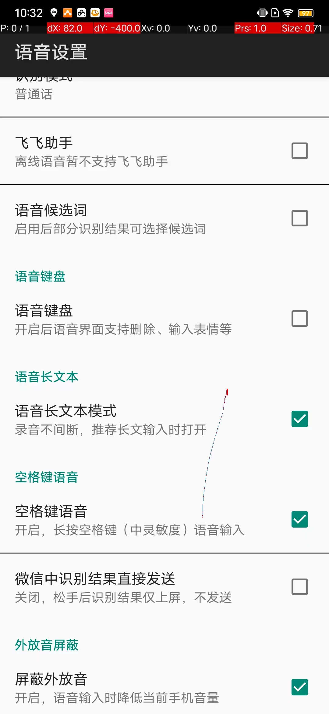
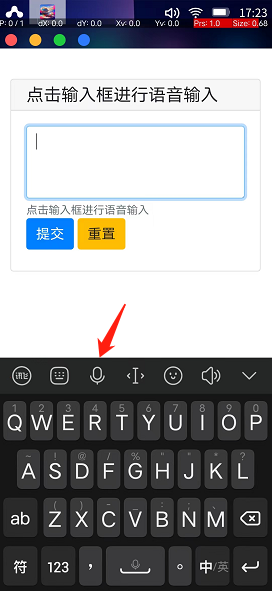
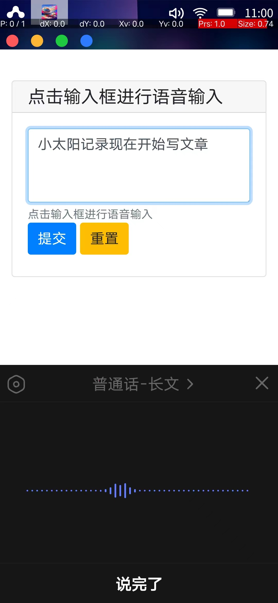

# 制作一个完全自己说了算的智能音箱 ——结合Aidlux的 Android 与 Linux 能力
> 假如你有以下想法

    - 使用小爱音箱，小度音箱时抱怨唤醒词无法更改？
    
    - 抱怨自家音箱语音识别差，想换个识别引擎却没法换？
    
    - 对自家智能音箱的声线不满意？
    
    - 嫌自家智能音箱的功能太小？
    
    - 使用各家的智能音箱无法自定义自动化操作？
    
    - 嫌安卓手机的语音助手要先亮屏才能语音控制？
    
    - 想拥有完全为自己定制的智能音箱？

**_那就自己做一个专属自己的智能音箱吧！_**

## 0. 前言

觉得要自己开发，没硬件，没算法，不好开发？在aidlux出现前的确如此。但有aidlux在就变得很简单了。

    - aidlux可以让linux跑在大部分安卓设备上。
    
    - 该硬件设备拥有控制安卓系统的功能、安卓应用的功能，还可以让自己的代码跑在该设备的linux上
    
    - 相当于把一台普通安卓手机变成一个后端linux服务器+前端操控设备。
    
本人觉得对于那些喜欢有空就搞搞机（别误会，是指喜欢倒腾硬件或软件的人）真是太赞。直接在淘汰下来的手机上开发服务器端及前端就好，开发环境还很方便，几乎0成本。

> 本文将举例介绍如何用一台旧安卓手机，实现具有语音备忘的智能音箱


项目代码gitee地址：https://gitee.com/kevin17/aid-lux-smart-assistant

项目代码github地址：https://github.com/kevinfu1717/AidLuxSmartAssistant


B站视频如下：

(<iframe src="//player.bilibili.com/player.html?aid=644531450&bvid=BV16Y4y1c7iU&cid=806231718&page=1" scrolling="no" border="0" frameborder="no" framespacing="0" allowfullscreen="true"> </iframe>)


## 1. 智能音箱的组成

智能音箱的组成需要：1.语音采集麦克风，2.语音播报喇叭，3.运算单元，4.语音识别系统，5.中控系统，6.后台服务，7.语音播报系统。
 
 - 其中，"1 语音采集麦克风"，"2 语音播报喇叭" 利用安卓手机的麦克风与外放喇叭。麦克风想要更灵敏可以另外在网上购买会议用的拾音器或超灵敏麦克风。但其实手机本身的麦克风收音感觉还是可以的，我用iqoo的在同一房间内还不错的，但需要处理会把语音播报的声音也收进来的问题（后续有介绍如何用代码处理这部分）
 - 而 "3 运算单元"就是使用安卓手机来运算。
 - 对于"4 语音识别系统" 当然可以自己用开源算法改一个，但效果可想而知。这里我们使用各家大厂的安卓语音输入法作为语音输入系统。步骤如下：
 
> 利用安卓输入法，白嫖各大厂的语音识别作为我们智能音箱的语音识别

a. 给手机装上安卓手机输入法作为语音输入系统，本人测试过百度输入法、搜狗输入法、讯飞输入法。个人感觉讯飞会识别准确度高一些，下面介绍用讯飞的方法。你也可以尝试百度或搜狗等语音识别。

b. 启动aidlux，并启动linux系统中编辑好的pywebio应用，点击输入框。这时会弹出安卓输入键盘。

c. 选择输入键盘中的语音输入

d. 讯飞的语音输入设置参考4.1中输入法设置

e. 这时说话的内容就会出现在输入框了
    

    
 - 其中的"5 中控系统"，"6 后台服务"，分别对应代码中的 frontend.py 与 backend.py, 后端也可以放在云函数上运行。我这里做的功能是个语音输入内容记录到飞书表格中
 
 - 对于"7 语音播报系统"，为了简单快捷，我使用了aidlux提供的调用安卓默认的语音，代码是 `droid.ttsSpeak(content)`，你用中意的语音也可以调用腾讯云、阿里云等语音合成服务来播报。
 
 ## 2.代码介绍
 
>  主要分成frontend.py的前端 与 backend.py的后端

数据流示意图：

<a href="url"></a>


### 2.1 前端 frontend.py

#### 2.1.1 作用：获取用户语音输入内容

#### 2.1.2 选用框架：pywebio 

使用pywebio 作为前端输入页面。使用其的原因是pywebio的 textArea输入框可以检测输入变化，触发回调函数。


#### 2.1.3 原理介绍：

我们利用输入法的语音，把说的内容文字输入到textArea框中后，因为框中内容有变化，其onchange会触发inputerRun函数，把textArea框中所有内容作为msg参数去请求后端。


```
 myTxt = textarea(label='点击输入框进行语音输入', rows=3,
                  type=TEXT, validate=None, help_text='点击输入框进行语音输入', 
                  onchange=inputerRun)
```


### 2.1 后端 backend.py

#### 2.1.1 作用：
处理用户的输入内容，并进行对应的处理

#### 2.1.2 选用框架：flask

响应前端的post请求。

#### 2.1.3 处理流程：

1. 接收请求：接收用户说的文字内容

2. 唤醒词识别：解析这段话的前缀是否有唤醒词，没有则忽略本次文本内容

3. 意图识别：解析是否有动作触发词，在这里例如“记录”，“记下”。

4. 语义提取：对句子做截断，把动作触发词后的内容作为真实内容。根据动作触发词去调用对应的函数。

5. 语义提取：识别真实内容中提到的记录事项的 开始时间 与 结束时间，以及提到的主角及记录内容。

6. 语音动作：调用飞书文档的模块，把提取的时间，主角，记录内容记录到飞书多维表格中。

7. 语音反馈：判断返回的结果，成功则触发安卓的toast提示，并语音播报情况。

#### 2.1.4 代码简述：

a. 概述：使用生产者消费者模式，使用python的多线程，线程间通讯用Queue。

b. backend.py中主函数

```
def main(port):
    port=int(port)
    # args.port=port
    log.info('port'+str(port))
    msgQueue=Queue(100) #输入框队列
    stateQeue=Queue(maxsize=100) # 状态队列，用于处理非双工的情况（会录回系统播放的声音）
    duplex=False # True双工，False 非双工

    ## 用户语音输入框处理模块,过滤出用户最新说的那些话
    inp=moduleInput.inputClass(msgQueue,stateQeue,postQueue,duplex=duplex,logger=log)

    ##  输出模块，控制语音播放或toast输出
    ouputer=moduleOutput.outputManager(stateQeue,logger=log)

    ## 文本内容处理，这里载入了moduleNer进行理解
    processer=moduleProcesser.processerClass(logger=log)

    ## 对话管理模块，整体对话管理，唤醒词识别，输出触发
    cm=moduleConversation.converManager(msgQueue,stateQeue,strategyDict,ouputer,processer, \
     wuWordList=['小太阳','太阳'],duplex=duplex,logger=log)
        
    cm.daemon = True
    inp.start()
    cm.start()

#    app.run(host="0.0.0.0", port=port, debug=False)  # 启动app的调试模式
    server=WSGIServer(("0.0.0.0",port),app)
    server.serve_forever()
    cm.join()

```


c. moduleInput中过滤出最新说话的内容newMsg，self.allData为整个文本框内容：


```
    def chiefProcess(self, data):
        #self.print('data'+str(data)+',alldata:'+str(len(self.allData)))
        self.newMsg = ""
        allDataLen=len(self.allData)
        if len(data) > allDataLen and allDataLen>0:

            newMsg = data[allDataLen:]
#            print('nnn',newMsg)
            ## not just a word
            if len(newMsg) > 1:
                ## newMsg为最新说话内容
                newMsg = self.preProcess(newMsg)
                self.processMsg(newMsg)
        ## allData为文本框中所有内容
        self.allData = data
```

d.moduleNer中的jioNLP的日期、时间提取：


```
    def localParseTime(self,text):
        try:
            result=jio.parse_time(text,time_base=time.time())

            # text="小太阳记录宝宝在半小时前开始吃奶。小太阳记录，妈妈准备洗澡。"
            # print(jio.parse_time(text, time_base=time.time()))
            # {'type': 'time_point', 'definition': 'accurate', 'time': ['2022-03-17 13:07:00', '2022-03-17 13:37:28']}
            time1=result['time'][0]#begin time
            time2=result['time'][1]#end time
            #
            time1=self.timeCheck(time1)
            time2=self.timeCheck(time2)

            self.print('ner time:'+str(time1)+' to '+str(time2))
        except:
            time1=''
            time2=''

        return time1,time2
```

d. moduleOutput中控制语音播报speak与安卓toast弹出文字提示，这里翻查了Aidlux文档找到相关的api。
> 需注意在非双工状态下（即麦克风采音无法滤去本身设备播报的声音，duplex=False ），处理模块会忽略掉系统播放的语音又被录入回系统的那一段语句。


```
class outputManager():
    def __init__(self,stateTimeQueue,duplex=False,logger=None):
        
        
        self.stateTimeQueue=stateTimeQueue
        self.duplex=duplex
        self.logger=logger
        print('init outputManager duplex',duplex)
    def setState(self,stateValue):
        self.state=stateValue
        self.stateTimeQueue.put(self.state)
    def print(self,strData):
        if self.logger is None:
            print(str(strData))
        else:
            self.logger.debug(str(strData))
    def speak(self, content):
        if not self.duplex:
            self.stateTimeQueue.get(block=True)
            
            self.setState(time.time())
            self.print('output change state say'+str(self.state))
            
        
        try:
            droid.ttsSpeak(content)
            self.print('speak'+"content")
        except Exception as e:
            self.print('speak fail'+str(content)+str(e))
            pass
    def toast(self, content):
        
        try:
            droid.makeToast( content)
            self.print('toast'+str(content))
        except Exception as e:
            self.print('toast fail'+str(content)+str(e))
            pass
```

e. 当到语音触发动作这步时，会调起feishuTool.py记录到飞书多维表格中。
其中，把所有需调用的相关账户信息都配置到header.py中

``` header.py
class appHeaderClass():
    def __init__(self,
    app_id="cli_a17e4xxxxxxx",app_secret="sCfxxxxxxxx"):
        self.app_id = app_id
        self.app_secret = app_secret
appHeader=appHeaderClass()
docDict={"doc1":"doccn869Sw1xxxxxxxxxxxxx"}#修改回你自己的
baseDict={"base1":"bascnjkQ3EIPk7xxxxxxxxxx"}#修改回你自己的
tableDict={"base1total":"tbl72Yxxxxxxxxxxx"}#修改回你自己的
queryUrl=r"http://127.0.0.1:7000/query"
nerUrl="云函数路径"#修改回你自己的
```


## 3.可优化选项

### 3.1 接收post请求

在这里运行在aidlux的linux系统中，也可以把这部分代码放到阿里云或腾讯云的云函数中。

### 3.2 唤醒词识别

可任意组合测试多个唤醒词，感觉几个字的组合比较好。有可能第一个字会识别不了。那例如想设置“小太阳”作为唤醒词，那可以设置wuWordList=['小太阳','太阳'],这样能更容易唤醒。

### 3.3 意图识别

这里因为自己使用，知道自己的常用于，所以直接使用关键词正则匹配。也可以训练一个nlp的分类模型进行意图识别，根据意图调用对应的函数。感觉PaddleNlp还是比较简单易用，比较快能训练一个，但好像默认没有安装这个框架。

### 3.4 语义提取

这里用了第三方时间库[jioNLP](https://github.com/dongrixinyu/JioNLP)来提取日期，开始时间，结束时间，还是挺准确的,适应的时间，日期类型也多。其原理是用正则匹配，包也较轻量。也可以用paddleNlp里的语义提取，只是包有点大。

### 3.5 处理逻辑

这里我的需求只是做一个智能音箱的语音记录及提醒功能。所以只是简单的逻辑处理，若要复杂处理可考虑使用Rasa进行对话管理。

### 3.6 语音反馈

这里直接通过 `droid.ttsSpeak(content)`调用系统声音合成。那当然，大家可以把要说的内容content去请求各大厂的语音合成库，去变成自己喜欢的声音来说话。


## 4. 设置

### 4.1 讯飞输入法设置

以讯飞输入法v11.1.6为例，设置使用语音输入，选择语音输入中的“长语音输入”。进入到语音设置中的选项如下,另可尝试体验一下方言，有粤语等：

<a href="url"></a>
<a href="url"></a>

### 4.2 Aidlux中设置

#### 4.2.1 电脑连接手机Aidlux

打开手机版的aidlux，进入Aidlux桌面后打开cloud_Ip查看手机IP,确保电脑与手机在同一局域网。电脑的浏览器输入该ip+端口，eg：http://192.168.1.11:8000

#### 4.2.2 复制程序

浏览器中打开Aidlux的文件管理器，把项目中scripts文件夹拷贝到里面。

#### 4.2.3 设置launch-builder

新建一个Aidlux中的launch-builder。

- 用于进入前端页面,设置"访问路径"为 http://127.0.0.1:3086/?app=inputterrun  

- 用于启动前端，后端程序，设置“启动命令”为 python3 路径/backend.py & python3 路径/frontend.py

- 使用单窗口，不勾选外部打开。其他可随意设置


## 5. 使用智能音箱

5.1 手机开机后，启动aidlux

5.2 双击启动刚刚设置的launch-builder

5.3 点击启动页面中的输入框，待弹出输入键盘后，选择语音输入

<a href="url"></a>

5.4 可以愉快地开始语音玩耍了

<a href="url"></a>

## 6. 不足

### 6.1 没有设置成功开机直接启动设置的launch-builder，若有大佬能设置请指导一下，导致现在进入aidlux后还要点某个图标启动

### 6.2 其实点击输入框弹出输入法窗口可以使用auto.js或 autopy lite来实现，这样就可以最终实现安卓一开机自动进入语音ready状态，就类似市面的智能音箱了。
